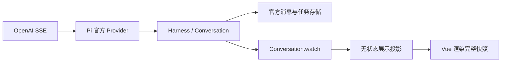

# Pi 1.0.2 会话持久化

会话层直接使用 `@earendil-works/pi-durable` 的 Session、Conversation、文档与原子事务，移除旧 SessionRepo、Branch 和浏览器 Map 会话实现。

浏览器与 Node 的运行通过 `Harness.open()` 装配：工具安装到官方 Registry，模型由 Pi Models 提供，输入交给 `Conversation.submit()`，生成及工具调度、失败重试和任务状态由 Harness 管理，取消调用 `Conversation.abort()`。OpenAI SSE 只由 Pi 官方 Provider 解析，应用不重复处理 `delta`、`done` 或 `[DONE]`。

`Conversation.watch()` 提供完整已提交视图，其中 Entry 保存最终模型消息，`pi.live` 保存完整流式 partial、思考过程与工具进度。`projectConversation()` 是无状态的展示投影：原样读取文本块，关联宿主轮次，并转换工具展示字段。Vue 用完整 `session.snapshot` 替换显示数组，不拼接文本、不累计用量、不重建运行过程。流式 partial 被官方最终 Entry 取代时，界面自然切换到最终完整文本。



应用只保存会话目录、宿主输入与重试的关联、宿主准备阶段失败和目录更新时间。工具的名称、摘要、证据、撤销信息、引用等显示字段随官方 tool-result 的 `details` 保存。已移除自建 UI 事件日志、事件编解码器和历史回放器；Vue 的旧 reducer 只留在测试脚本目录，生产入口不导出或调用它。独立 `PiRunDriver` API 不参与持久化面板运行。

每个应用会话拥有主 Conversation；重试在原用户输入之前的边界通过官方 `Conversation.fork()` 创建新 Conversation。主会话与重试分支共享历史，但重试不会继承失败运行或其后的消息。身份文档记录应用会话 ID、分支、标题与删除状态。展示历史读取全部分支的官方消息，按全局 Entry ID 去重，并完整消费分页游标；历史回复在原位置替换，保留后续旧轮次的展示，但模型上下文始终由当前官方分支决定。

生产重新生成使用 `Conversation.fork()` 的 `init` 事务写入新运行起点。当前分支由所有 Conversation 中最后提交的运行起点推导；尚无运行记录时使用主分支，无需额外维护活动标记。后续用户输入直接提交到当前 Conversation，模型读取官方分支上下文，包含重新生成的答案而不包含被替换的答案。UI 替换仅负责原位置展示，不决定模型上下文。

运行状态来自官方 Submission；宿主结束标记补充时间与准备阶段失败信息，不保存消息或用量。宿主重启时先通过官方取消协议结算未完成任务，再标记 interrupted；不会自动重新执行可能产生副作用的工具。Pi 已经提交成功答案但宿主尚未更新目录时，恢复保留成功终态。

## 浏览器

官方包提供 MemoryStorage、可移植 JsonlStorage 与 SQLite 存储，没有现成的 IndexedDB Storage。浏览器使用官方 JsonlStorage，通过 IndexedDbFileSystem 将文件保存到 IndexedDB。应用不自行实现 Pi 记录、分支或事务模型。

浏览器 Bridge 与 Node 使用同一个 AgentApplicationService 和 RuntimeSessionService。实时显示与刷新恢复都从官方状态投影同一种完整快照，不再另存或回放 UI 消息事件。

```ts
import { createBrowserRuntimeSessions } from '@363045841yyt/klinechart-agent-runtime/browser'

const runtime = await createBrowserRuntimeSessions()
const session = await runtime.sessions.create('Market analysis')
// 宿主卸载时释放存储连接与写锁。
await runtime.close()
```

需要 IndexedDB、Web Locks 与安全上下文（HTTPS 或 localhost）。同一个 origin 的同一数据库只允许一个宿主持有写锁；第二个页面会明确报告冲突。关闭宿主会等待写锁实际释放；页面退出时浏览器也会释放锁。浏览器存储遵循 origin 隔离与配额规则，清除站点数据会删除历史。

## Node

`createNodeRuntimeSessions` 改为异步工厂，直接调用官方 `openNodeSqliteStorage`，移除 `cwd`、NodeExecutionEnv 和独立 SQLite 后端依赖。要求 Node 22.19+。

```ts
import { createNodeRuntimeSessions } from '@363045841yyt/klinechart-agent-runtime/node'

const runtime = await createNodeRuntimeSessions({ databasePath: './agent-durable.sqlite' })
await runtime.close()
```

底层 Session 由宿主创建并关闭；RuntimeSessionService 不拥有该资源。测试通过官方 MemoryStorage 注入独立会话，浏览器存储测试通过 IndexedDB 标准实现与真实 Web Locks 验证重开及独占写入。

## 数据边界

仅接受当前会话 schema；旧版和未来版本均明确报错，不提供读取时迁移或旧格式导入。旧浏览器会话只存在内存中，没有可迁移的持久化历史。旧 SessionRepo SQLite 格式与官方 durable 格式不同，Node 宿主需要使用新的数据库文件。会话删除采用持久化删除标记，历史不再显示或参与运行；不会物理清除底层不可变历史。
