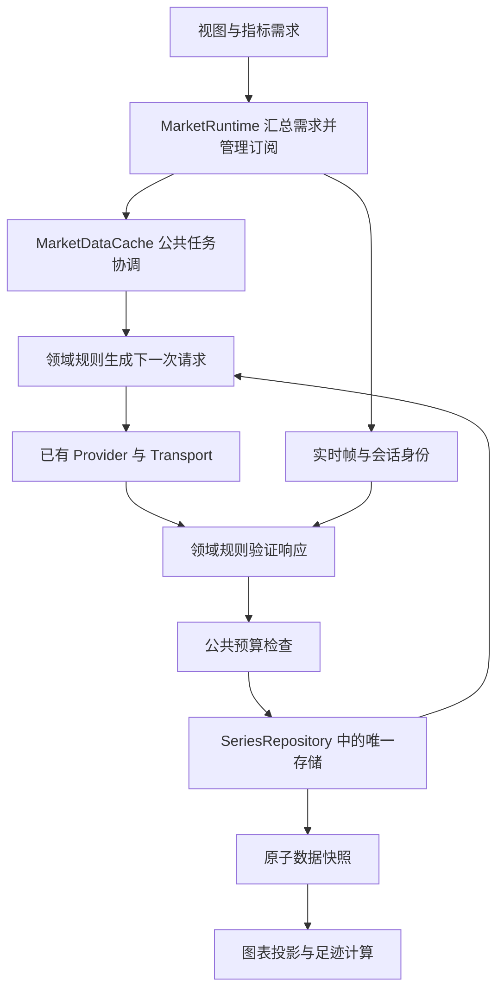

# 行情加载统一架构

## 目标与范围

K 线、分时和原始成交使用同一套实例管理、请求协调、取消、重试与资源预算。各数据领域只定义自己的请求方式、数据身份、合并规则和完整性证明。

足迹是原始成交在 K 线时间边界上的计算结果。它不拥有连接、历史加载任务或另一份成交缓存。切换 K 线周期、足迹参数和指标实例，不改变原始成交的身份。

本文件规定目标架构。实现必须满足下面的数据归属和行为约束；不能以修改了哪些旧函数作为重写完成的依据。当前实现与目标的差异列在最后。

## 根本问题

原加载模型混淆了三种含义不同的信息：已经收到的成交、已经验证完整的时间范围、当前查询的执行状态。最新成交的到达时间被用于推断覆盖；一次请求失败又被用于排除后续请求。

这使暂时的加载状态改变了长期的数据事实。错误覆盖一旦写入，后续补载就失去了修复缺失数据的依据。

新模型分别管理数据事实和加载任务。只有经过验证的数据输入能改变完整性；连接、加载和失败状态只能影响任务执行与界面提示。

## 数据归属

| 内容 | 唯一管理位置 | 生命周期 |
| --- | --- | --- |
| 原始行情、数据身份和已验证覆盖 | SeriesRepository 中的领域存储 | 品种与来源实例的生命周期 |
| 当前视图、指标或其他消费者的范围需求 | MarketRuntime 的需求协调 | 消费者的生命周期 |
| 在途查询、重试、取消及查询错误 | MarketDataCache 的公共请求管理 | 一次加载任务的生命周期 |
| 实时订阅与会话身份 | MarketRuntime | 一次订阅会话的生命周期 |
| 缓存字节统计与回收决策 | MarketDataCache 的现有条目表 | 数据条目的生命周期 |
| 足迹聚合结果 | 指标计算链路 | 原始数据版本与计算参数的生命周期 |

SeriesRepository 是数据实例目录，各领域存储是原始数据的唯一事实来源。缓存条目只引用这些实例并记录管理信息。图表快照和查询结果是投影，不再维护一份能够独立判定完整性的原始数据副本。

成交存储可以保留去重索引和当前连续段的证明信息，这些信息由收到的成交决定。它不保存视口需求、请求控制器、加载标记、失败名单或重试策略。

## 统一执行流程

公共协调器负责等待已有任务、读取最新需求、执行下一次请求、有限重试、校验取消资格和提交结果。每次提交后重新计算剩余需求；消费者滚动或数据变化更新需求，不另起一套加载循环。

领域规则负责决定下一次请求的内容：K 线使用根数与游标，分时使用交易日，成交使用缺失时间范围。它们不各自拥有请求循环、取消机制或失败恢复链路。复用已有 MarketDataCache 的协调能力，不新增与它并列的加载管理器。

历史响应和实时帧通过各自的协议验证后，写入同一个领域存储。它们可以携带不同的完整性证明，但必须共用身份合并、预算准入和原子提交机制。

## 成交事实与完整性

成交快照包含收到的成交、已验证覆盖、数据已延伸到的时间和版本号。加载状态由任务与当前需求另行提供，不写入成交事实快照。

- tradeId 是成交身份。同一毫秒的不同成交都必须保存，时间戳只用于排序和归属 K 线。
- coverage 是已验证的左闭右开范围。存储中有成交，不代表成交所在的整根 K 线已经完整。
- latestTimestamp 是数据已延伸到的时间。它只用于判断新旧，不能代替 coverage，也不能跨过缺口宣布数据完整。
- 数据和覆盖在一次提交中更新。删除数据时必须同时撤销对应覆盖，不能留下可以阻止补载的旧证明。

历史响应只有明确证明请求范围完整，才能扩展 coverage。完整的空响应可以证明该范围零成交；失败、取消和不完整响应不能证明零成交。

实时覆盖只能来自协议所保证的连续序列。对于当前提供连续 tradeId 的成交源，每段首毫秒通过历史重叠验证，段末毫秒在更晚成交到达前保持待确认。帧内跳号分割连续段，不使用整帧首尾时间跨越缺口。

如果某数据源不提供足以证明连续性的协议，实时成交仍可作为部分数据展示，但完整性必须由完整历史查询确认，不能自行推断。

## 断线恢复与并发

10:00 睡眠、10:05 恢复时，先收录 10:05 的实时成交，同时保留中间未验证范围。公共协调器根据当前需求和 coverage 请求缺失历史；验证并合并成功后，原子发布新快照，足迹计算重新生成受影响的结果。

恢复过程遵守以下约束：

1. 断线和重连终止旧会话的连续性证明，保留此前已经验证且尚未回收的数据。
2. 新会话的数据可以先展示，但不能填平旧会话留下的缺口。
3. 历史与实时交界允许有意重叠，按成交 ID 去重，不能通过裁掉某一毫秒避免重复。
4. 临时失败保留为未满足的需求，由公共重试与恢复策略处理；不建立永久失败范围。
5. 切换品种、取消查询、清空缓存或销毁后，旧任务失去提交资格。即使 Provider 不及时响应取消，迟到结果也不能重新写入。
6. 到达顺序、分帧方式和消费者切换只能改变加载过程，不能改变同一完整数据集的最终成交量、Delta 和档位结果。

## 资源预算

使用已有行情缓存的条目表、字节估算和回收机制。成交不再设置另一套固定条数预算，也不建立第二份登记表。

预算管理是写入前的准入规则。先回收需求外的数据，并同步撤销覆盖；仍无法容纳当前需求时，返回明确的容量不足状态，由消费者缩小需求后继续。不能允许一个持续增长的成交条目无条件突破预算，也不能为了腾出空间把未加载范围当成零成交。

实时输入同样接受预算检查。预算不足不能通过丢弃成交却推进覆盖水位来维持表面正常。

## 完成标准

完成重写以行为和归属为准：原始成交只有一个存储实例；加载任务只有公共协调器管理；需求与任务状态不进入成交事实；历史和实时使用同一提交机制；回收与取消不会留下错误覆盖。

关键验证使用公开输入与最终结果，覆盖同毫秒分帧、帧内跳号、睡眠恢复、历史实时交界、临时失败、迟到响应和预算回收。完整数据集的结果必须与一次完整历史加载一致。无需测试私有字段或复制实现步骤。

## 实现边界

TradeBuffer 发布 TradeFacts，仅包含版本号、价格精度、成交批次、已验证覆盖和数据已延伸到的时间。实时连续段起点作为协议证明保留在存储中，不包含消费者需求。prepareHistory 和 prepareFrame 返回待提交更新，公共缓存完成准入后才能 commit；被拒绝的实时输入终止连续性证明，以便恢复后补回缺口。

MarketDataCache 的查询记录持有范围、加载状态和错误。指标输入由 getTradeSnapshot 将事实与任务状态合成；这份投影不承担缓存身份或完整性判断。MarketRuntime 订阅事实和任务版本，发布同一指标输入。

K 线与成交使用 ensureQuery 和 runQuery。领域入口提供 next，公共循环执行请求步骤；成交页不再拥有独立 while 循环。请求取消与有限重试沿用同一公共实现。

成交历史与实时通过 commitTrades 做写入准入。检查候选快照字节数，回收其他缓存条目和当前需求外的成交，再重新准备候选更新。无法容纳时拒绝写入，不发布候选数据或覆盖。现有 K 线、分时缓存的单项超限策略未在此次成交重写中改变；不得据此宣称全部行情领域的预算规则已经统一。

现有 K 线缓存和图表 DataBuffer 仍具有各自快照，DataBuffer 继续作为图表投影入口。这次替换的是成交加载链路，没有重写 K 线与分时的原始数据归属；它们与目标架构的差异需要单独收敛，不能通过扩大此次足迹问题的修改范围隐式完成。
