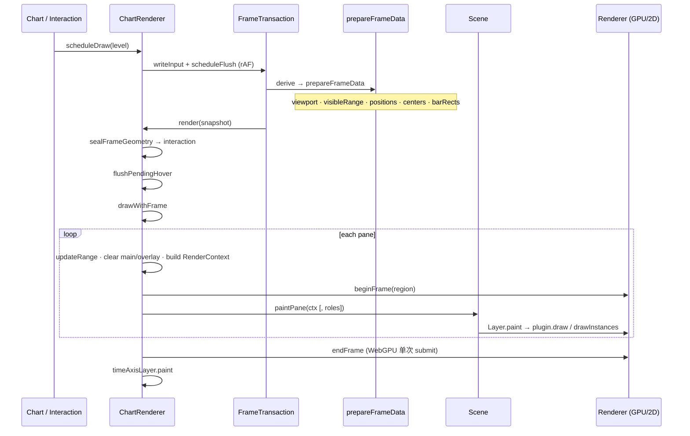

# 渲染链路

> 日期：2026-07-17  
> 范围：`packages/core` 实际绘制路径

之前散落在 `architecture.md`、`rendering-engine-architecture.md` 等旧文档里的渲染描述，路径和主链路都已经过时。这篇把当前代码里的真实绘制流程整理出来，作为单一入口。

---

## 1. 目标与原则

画清楚、别糊、别漂，是底线。具体做到三点：

- Canvas 物理像素跟 DPR 对齐，K 线几何在物理像素空间算完再回写逻辑坐标。
- 尺寸 / DPR / scroll / zoom 由 StateKernel 里的 viewport、zoom、options 子模块统一维护，绘制和交互读同一帧几何。
- 帧事务隔离：scheduleDraw 只合并输入，flush 里 prepare → seal → paint，paint 阶段不再反向写 kernel 几何。

另外两条是后面加进来的，跟旧文档差异比较大：

- 主 paint 走 `Scene.paintPane`，不再走 `RendererPluginManager.render(paneId)`。Manager 保留注册、配置、启停，但调度权让给了 Scene。
- 业务层通过 `Renderer`（`drawInstances` / `drawLines`）画 GPU，返回 `false` 时走 Canvas2D 兜底。禁止双路径并存。

---

## 2. 分层与职责

从 Framework 到 GPU，调用链大概是：

```text
Framework (vue / react / angular)
  mount DOM、转发事件、读 readonly signals
  ↓
Chart (engine/chart.ts)
  状态代理、scheduleDraw 代理、插件 install 桥接 Scene
  注意：不是绘制管线本身
  ↓
ChartRenderer (engine/render/chartRenderer.ts)
  FrameTransaction、prepareFrameData、drawWithFrame
  ↓
Scene / Layer (rendering/scene/*)
  z 序 paint、role 过滤、异常隔离
  ↓
Renderer (rendering/render/*)
  WebGPU → WebGL → Canvas2D fail-closed
  ↓
Surface / GPU
```

各层职责简要说明：

**Framework**（`packages/vue|react|angular`）：管容器 DOM、指针滚轮事件、主题偏好注入，不维护独立 resize 管线。

**Chart**（`packages/core/src/engine/chart.ts`）：持有 kernel、viewportManager、layout、ChartRenderer。`scheduleDraw` 和 `installRenderer` 都是代理调用。

**State**（`engine/state/*`）：viewport、zoom、options 等 SSOT。

**Viewport DOM**（`engine/viewport/chartViewportManager.ts`）：ResizeObserver + scroll 监听，结果写进 kernel actions。

**Paint**（`engine/render/chartRenderer.ts`）：帧事务、几何 prepare、逐 pane paint、时间轴。

**Scene**（`rendering/scene/*`）：Layer 组合、`paintPane`、LayerRegistry。

**Backend**（`rendering/render/*`）：`Renderer` 接口、`RendererHost`、WebGPU/WebGL/Canvas2D。

**Plugin 元数据**（`foundation/plugin/*`）：注册表、配置、启停。主 paint 不调用 Manager.render，但 installRenderer 仍走这里。

**业务绘制**（`engine/renderers/*`、`engine/render/layers/*`）：旧 `RendererPlugin.draw` 经 `createLayerFromPlugin` 挂到 Scene。

---

## 3. 单帧主链路

### 3.1 入口

| API | 行为 |
|-----|------|
| `Chart.scheduleDraw(level?)` | 代理到 `ChartRenderer.scheduleDraw`。runtimeProjection 期间只记 pending，不重复调 |
| `Chart.draw(level?)` | 同步 flush，测试或强制上屏时用 |
| `ChartRenderer.scheduleDraw` | 合并 UpdateLevel，frameTx.writeInput + rAF scheduleFlush |
| `ChartRenderer.draw` | 非 idle 时只写输入并调度下一帧，禁止嵌套 flush |

`UpdateLevel` 分三档：`Main`（只刷主层）、`Overlay`（只刷覆盖层）、`All`（全刷）。两档合并时自动升为 All。

### 3.2 帧事务

实现见 `foundation/reactivity/frameTransaction.ts`。流程不复杂：

`writeInput({ level })` 把请求写进 pending。如果事务正在跑（非 idle），就进 nextPending，等当前帧完后再合并。

这里说的事务状态：

- **idle**：没有正在进行的帧事务，可以安全写入 pending 或直接 flush。
- **非 idle**：`capturing` / `deriving` / `sealing` / `rendering` / `publishing` 五个阶段之一，表示当前帧正在执行。此时禁止嵌套 flush，新写入只能进入 nextPending。

`scheduleFlush` 或 `flush` 触发实际绘制，内部走五个阶段：

1. **capturing** — 封存 input，之后的新写入只能进 nextPending
2. **deriving** — `prepareFrameData(level)` 产出 FrameDrawSnapshot
3. **sealing** — freeze 快照根，大数组结构共享，禁止深拷贝
4. **rendering** — `sealFrameGeometry` → `flushPendingHover` → `drawWithFrame`
5. **publishing** — published$ 通知订阅者

不变量：derive 阶段禁止写 DOM 或 kernel 副作用；render 阶段再 writeInput 只能进下一代。

### 3.3 时序图



### 3.4 与旧文档的差异

旧文档的描述跟当前代码差别不小，挑几个最明显的：

- 旧：Chart.draw 内直接 computeViewport + Manager.render。新：Chart.draw 只代理，viewport 已在 kernel computed，paint 在 ChartRenderer 里完成。
- 旧：rendererPluginManager.render(paneId) 是主调度。新：scene.paintPane 接管，Manager 保留注册/配置/启停。
- 旧：renderPlugin('timeAxis')。新：timeAxisLayer.paint，独立 Layer，不进主 Scene 列表。
- 旧：路径写 `src/core/*`、`src/plugin/*`。新：代码在 `packages/core/src/engine/*`、`foundation/plugin/*`、`rendering/*`。

---

## 4. Prepare：几何 SSOT

入口 `ChartRenderer.prepareFrameData(level)`。

### 4.1 Viewport

读 `deps.viewport.readonly.viewport`。`viewWidth === 0` 表示还没首帧，直接返回 null。

Overlay 且有 `cachedDrawFrame` 时复用上一帧 viewport、range、几何，跳过重算。

Viewport 各字段都是逻辑像素：

```ts
{ viewWidth, viewHeight, plotWidth, plotHeight, scrollLeft, dpr }
```

来源是 `viewportState` 的 `cachedViewport` computed（`computeViewport` + DPR 钳制 + scroll 吸附）。

### 4.2 可见范围

`getVisibleRange(scrollLeft, plotWidth, kWidth, kGap, total, dpr)` 在 `engine/viewport/viewport.ts` 里。

所有计算在物理像素空间做，跟 `calcKLinePositions` 共用 `getPhysicalKLineConfig`。左右各扩一根，减轻边缘断线；`start` 可能为 -1，prepare 里再 clamp 到 0。

### 4.3 K 线几何

`getPhysicalKLineConfig(kWidth, kGap, dpr)`（`engine/utils/klineConfig.ts`）给出物理像素配置：

- `kWidthPx`：奇数化后的实体物理宽度，影线能居中
- `kGapPx`：间隙物理像素
- `unitPx`：`kWidthPx + kGapPx`
- `startXPx`：起始偏移，等于 `kGapPx`

`calcKLinePositions(range)` 按 `startXPx + dataIndex * unitPx` 算每根 K 线的左端，再 `/ dpr` 转回逻辑像素。

同帧继续算 `kLineCenters`（影线中心，物理奇数宽 → 半宽对齐 → `/ dpr`）和 `kBarRects`（实体 `x` 和 `width`，bar 宽取奇数）。

TimeShare 模式会覆盖上述结果，按 `plotWidth` 平分 bar。

这些几何写入 `cachedDrawFrame`，Overlay 帧直接复用。

### 4.4 Seal

`sealFrameGeometry` 在 paint 之前调用：

```text
interaction.setKLinePositions(positions, range, kWidthPx, centers)
```

交互的 hover 二分、十字线重算，跟本帧绘制同代几何，不会错位。

---

## 5. Draw：Pane 与 Scene

### 5.1 Canvas 结构

每个 pane（PaneRenderer）有三张 canvas：

- `mainCanvas` — 静态主层（K 线、指标、网格等）
- `overlayCanvas` — 动态覆盖层（十字线等 `layer: 'overlay'`）
- `yAxisCanvas` / 可选 `leftYAxisCanvas`

全局一张 `xAxisCanvas` 画时间轴，`timeAxisLayer` 单独 paint，不进主 Scene 列表。

WebGPU 时 plot 区还会挂一张可见 GPU canvas，放在 main 和 overlay 之间做 hybrid DOM。

绘制前对 2D ctx 做 `setTransform(1,0,0,1,0,0)` + `scale(dpr, dpr)`，业务代码仍写逻辑坐标。

### 5.2 renderPanes

对每个 PaneRenderer：

1. 非缓存帧时，调 `mode.updatePaneRange` 合并主图指标极值、对比标的等价价位。
2. 按 level 清空 main / overlay / 轴 canvas。
3. 构建 RenderContext，塞入数据、range、几何、theme、settings、共享轴 labels 等。
4. 写入 `paneCtxMap`，设 `currentPaneId`。
5. `sceneRenderer.beginFrame(region)`（`region.y = pane.top`）。
6. `scene.paintPane(...)`。Main/All 时画全部可见 layer；仅 Overlay 时只画 `['overlay']` 角色的 layer。
7. 全部 pane 结束后 `sceneRenderer.endFrame()`。WebGPU 在这里做一次 submit。

### 5.3 Scene / Layer

`createScene()`（`rendering/scene/createScene.ts`）维护 layer 列表，`paintPane` 时过滤 paneRole 和 visible，稳定按 z 排序后调用 `layer.paint`。dispose 后全部 no-op。

`createLayerFromPlugin(plugin, getContext, targetPaneId)` 桥接旧 RendererPlugin：

- paint 时注入 `context.sceneRenderer = ctx.renderer`
- 单层 try/catch，异常不中断同 pane 后续 layer
- priority 转 z，plugin.layer === 'overlay' 时 role 设 overlay

### 5.4 内置 Layer

`initCoreRenderers` 里硬挂的 layer 有：

- gridLines（global）
- candle（main）
- lastPriceLabel / lastPriceLine（main）
- comparisonLine（main）
- customMarkers / extremaMarkers（global）
- mainIndicatorLegend（main）
- crosshair（global，overlay）
- yAxis / leftYAxis（global）
- drawing / drawingLabel（global，registerDrawingPlugins 时挂）
- timeAxis（独立，不进 scene）

动态指标等通过 `Chart.installRenderer` 注册：先 `RendererPluginManager.register`，再 `createLayerFromPlugin` + `scene.addLayer`。启停时 `setLayerVisibility` 管 Scene，`setEnabled` 同步 Manager 元数据。

---

## 6. UpdateLevel 与双层 Canvas

| Level | 几何 | Main canvas | Overlay canvas | Scene roles |
|-------|------|-------------|----------------|-------------|
| All | 重算 | 清 + paint 全 layer | 清 + paint | 全部 |
| Main | 重算 | 清 + paint 全 layer | 不强制 | 全部 |
| Overlay | 复用 cache | 跳过 | 有十字线或上一帧有时清 + paint | 仅 overlay |

十字线移动等高频交互应调 `scheduleDraw(UpdateLevel.Overlay)`，避免重刷主层。

---

## 7. Viewport / DPR

### 7.1 观测

`ChartViewportManager.init` 做三件事：

1. `kernel.initViewport()` 写首帧尺寸，不依赖 ResizeObserver 是否可用。
2. container 的 scroll 事件 → `viewport.actions.syncFromDomScroll`。
3. ResizeObserver 优先 `device-pixel-content-box`，失败回退默认 observe。从 `devicePixelContentBoxSize / contentBoxSize` 算 preciseDpr（1/64 吸附）。

尺寸或 DPR 变化时回调 `onResizeCompleted` → `Chart.resize` → 清 cachedFrame、layoutPanes、`scheduleDraw`。

### 7.2 有效 DPR

`getEffectiveDprLogic(preciseDpr)` 的逻辑：

- Electron 环境单独分支，直接读 `window.devicePixelRatio`。
- 否则 preciseDpr > 0 用 precise，否则用 `devicePixelRatio`（1/64 吸附，最低 1）。

`clampDpr` 在 `viewW * dpr * viewH * dpr > 16M` 时主动降 dpr，防止超大视口爆内存。

### 7.3 DOM 副作用

viewportState 的 effect（`setupCanvasSync`）负责：

- canvasLayer CSS 尺寸同步
- xAxisCanvas 物理 width/height
- scrollContent 宽度、container.scrollLeft
- 共享 WebGL / RendererHost surface resize

绘制和交互只读 `readonly.viewport` 或 `getViewport()`，禁止各模块私读 `window.devicePixelRatio`。

---

## 8. Renderer 后端

### 8.1 接口

`rendering/render/Renderer.ts` 定义了高层绘制原语：

- 资源：`createBuffer` / `writeBuffer` / `createPipeline` 等
- 帧：`beginFrame(region)` · `drawInstances` · `drawLines` · `endFrame`
- `drawInstances` / `drawLines` 返回 boolean，false 时调用方走 Canvas2D 兜底
- `dispatchCompute` 仅 WebGPU，WebGL 抛错，调用前查 `caps.compute`

### 8.2 RendererHost

`createDefaultRendererHost(preference)` 或 `createDefaultRendererHostSync()`：

| preference | 尝试顺序 |
|------------|----------|
| webgpu | WebGPU → WebGL → Canvas |
| webgl | WebGL → Canvas |
| canvas | Canvas |

runtime.effective 跟用户 preference 可能不一致，降级时 status 为 degraded。WebGPU device lost 会自动降级 WebGL。支持 `switchTo` 热切换并触发 redraw。

Chart 构造默认走同步路径：优先 WebGL，失败 Canvas。

### 8.3 与 Layer 的关系

已迁路径（如 candle）在 `plugin.draw` 里使用 `context.sceneRenderer`：

```text
drawInstances / drawLines → true  用 GPU
                         → false 填 2D ctx
```

业务层禁止直接持有 WebGL context 或第二套绘制 API。

### 8.4 WebGPU 帧边界

每 pane `beginFrame(region)` 记录绘制，全部 pane 结束后一次 `endFrame()` submit。

空数据 clear 时，若 `caps.name === 'webgpu'`，对 surface `clearRegion`，不经 2D clearRect。

WebGPU 的 Retained Scene 还在规划阶段，当前每帧仍是临时 buffer + 多次 submit。细节见 `docs/superpowers/specs/2026-07-16-webgpu-retained-scene-design.md`。

---

## 9. 状态与绘制边界

| 数据 | 写入方 | 读取方（绘制） |
|------|--------|----------------|
| scroll / dpr / plot 尺寸 | viewport actions + ResizeObserver | prepareFrameData |
| kWidth / zoomLevel | zoom / options actions | prepare + RenderContext |
| K 线数据 | dataManager / data actions | getRenderData() |
| 主题 | settings + systemTheme → effective theme$ | RenderContext.theme |
| 绘图对象 | drawing actions | drawing layers |
| 指标计算结果 | indicator scheduler → StateStore | 指标 plugin.draw |

绘制路径只 peek 或读 RenderContext，状态变更走 actions，再 scheduleDraw。

---

## 10. 关键文件索引

按主题归类，路径都是 `packages/core/src/...`：

**编排入口**
- `engine/chart.ts` — Chart 主类
- `engine/render/chartRenderer.ts` — 帧事务、prepare、paint

**状态与视口**
- `engine/state/viewportState.ts` — viewport SSOT、DPR 计算、DOM effect
- `engine/viewport/viewport.ts` — getVisibleRange、getVisiblePriceRange
- `engine/viewport/chartViewportManager.ts` — ResizeObserver、scroll 监听
- `engine/utils/klineConfig.ts` — getPhysicalKLineConfig

**Scene / Layer**
- `rendering/scene/createScene.ts` — Scene 实现
- `rendering/scene/createLayerFromPlugin.ts` — Plugin→Layer 桥接
- `rendering/scene/types.ts` — LayerRole、PaneRole、PaintContext

**Renderer 后端**
- `rendering/render/Renderer.ts` — Renderer 接口
- `rendering/render/rendererHost.ts` — RendererHost、降级、热切换
- `rendering/render/createDefaultRendererHost.ts` — 默认 Host 构造
- `rendering/render/createWebGLRenderer.ts` — WebGL 实现
- `rendering/render/createWebGPURenderer.ts` — WebGPU 实现

**插件与 pane**
- `foundation/plugin/rendererPluginManager.ts` — 注册表、配置、启停
- `engine/layout/pane.ts` — Pane、UpdateLevel
- `engine/render/layers/*` — 内置 layer 工厂

---

## 11. 踩坑记录与验证

### 血泪教训

之前 MACD 副图和主图蜡烛共用 instance buffer，结果 MACD 一写就把蜡烛实体盖掉了。根因是 `drawRectBatchesViaRenderer` 每调用都把 slot 归零，主副图两批数据在同帧抢同一个 GPU 缓冲区。修复方案改成每批新建 instance buffer，pipeline 和 unit vertex 才缓存。细节见 `rendering/render/createWebGPURenderer.ts` 和 `engine/renderers/rectsViaRenderer.ts`。

另一个要注意的：GPU 后端必须以物理像素处理坐标，不能按逻辑像素算。

### 验证清单

1. 浏览器缩放 80/100/125/150% 下线条清晰
2. 跨屏 DPR 变化后立即恢复清晰
3. 容器 resize：无闪烁、无错位
4. 十字线 Overlay 重绘：主层不闪、几何不漂
5. 缩放/平移后 marker、drawing、tooltip 命中对齐
6. WebGL 不可用时自动 Canvas，图表仍可交互
7. 主图 + 副图同时有 GPU 批次时，主图实体不被副图覆盖（instance buffer 不跨 draw 复用）

---

## 12. 非目标

这篇不写：

- 指标算法与 Worker 调度细节
- 语义化 JSON 配置映射（`features/semantic`）
- WebGPU Retained Scene 的完整性能规划（见 superpowers specs）
- Framework 组件 API 与 props 说明（见各 package README）
